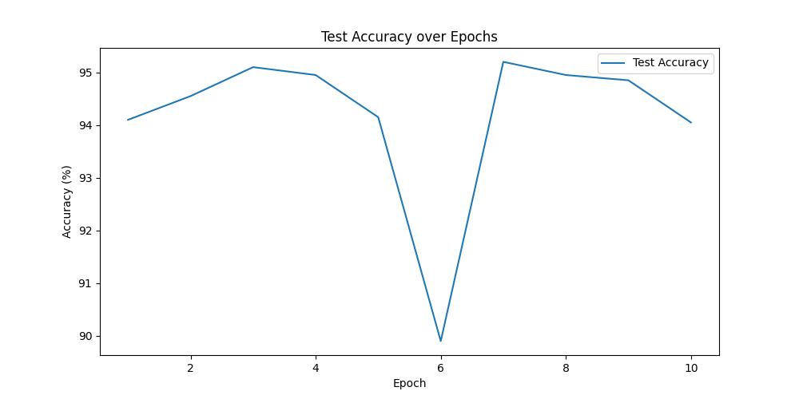
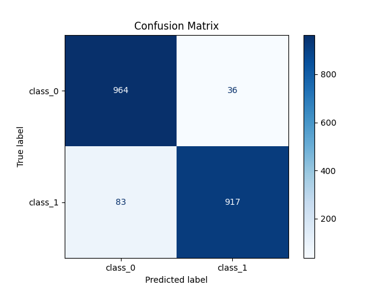

# ViT Image Classification

This project implements an hearing loss  classification model using the Vision Transformer (ViT) architecture. The model is trained and evaluated on our custom dataset,

## Project Structure
- `dataset`: Directory containing training and testing data.
- `models`: Directory where trained model checkpoints are saved.
- `main.py` : Full Fine Tuning the ViT baseline model(`google/vit-base-patch16-224`)

## Track Training and Evaluation
- Training loss for each epoch
- Test accuracy for each epoch
- Accuracy graph
- Confusion matrix

## Dependencies
- torch
- torchvision
- transformers
- scikit-learn
- matplotlib

## Result of Evaluation

